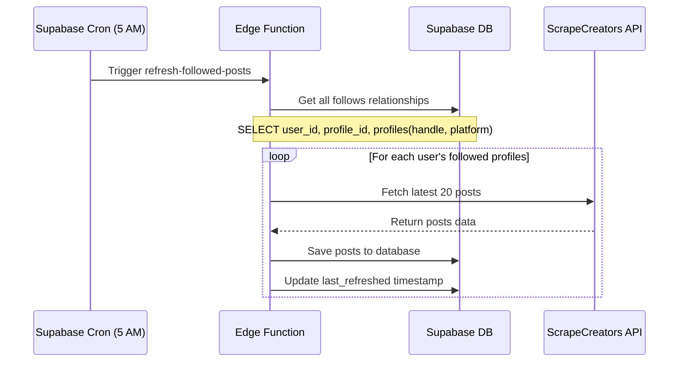

# Following Page Optimization - Daily Batch Processing Implementation

## 📋 **Project Overview**

This document outlines the optimization strategy for the Following page in Use Narra, implementing a daily batch processing system to dramatically reduce API costs and improve user experience.

## 🎯 **Current Problem**

### **Existing Following Page Flow:**

1. User visits Following page
2. App makes real-time API calls to ScrapeCreators for each followed profile
3. User waits 2-3 seconds for data to load
4. High API costs on every page visit
5. Inconsistent performance

### **Pain Points:**

- ❌ Slow loading times (2-3 seconds per visit)
- ❌ High API costs (multiple calls per page view)
- ❌ Poor user experience
- ❌ Unpredictable scaling costs

## 💰 **ScrapeCreators API Pricing Analysis**

### **Confirmed Pricing Model:**

- **"1 Request = 1 Credit"** (officially stated)
- **1 API call can fetch up to 30 posts**
- **Cost per credit: $0.002** (Solo Dev plan)

### **Actual Cost Breakdown:**

- 1 API call = 1 credit = Up to 30 posts = $0.002
- **Cost per post = $0.002 ÷ 30 = $0.000067 per post**

### **Current vs Optimized Costs:**

#### **Current System (Per User Per Day):**

```
User visits Following page 10 times/day
Each visit: 12 followed profiles × 1 API call = 12 calls
Daily cost: 10 visits × 12 calls × $0.002 = $0.24/day
Monthly cost: $0.24 × 30 = $7.20/month per user
```

#### **Optimized System (Per User Per Day):**

```
Daily batch job: 12 followed profiles × 1 API call = 12 calls
Daily cost: 12 calls × $0.002 = $0.024/day
Monthly cost: $0.024 × 30 = $0.72/month per user
```

#### **Cost Savings:**

- **Per user: $7.20 - $0.72 = $6.48/month (90% savings)**
- **For 1000 users: $6,480/month savings**

## 🚀 **Proposed Solution: Daily Batch Processing**

### **Core Concept:**

Replace real-time API calls with a daily background job that pre-fetches and stores posts from followed creators.

### **🔄 Daily Fetching & Saving Process (Detailed Flow)**



#### **Step-by-Step Process:**

1. **Trigger (5 AM Daily)**

   - Supabase cron job activates
   - Calls Edge Function `refresh-followed-posts`
   - Uses service role key for full database access

2. **Get Follow Relationships**

   ```sql
   -- Get all active follows with profile info
   SELECT
     follows.user_id,
     follows.profile_id,
     profiles.handle,
     profiles.platform
   FROM follows
   JOIN profiles ON follows.profile_id = profiles.id
   WHERE follows.active = true;
   ```

3. **Process Each Follow**
   ```typescript
   // For each follow relationship:
   for (const follow of follows) {
     // Get latest posts from ScrapeCreators
     const posts = await scrapeCreators.getProfileVideos(
       follow.profiles.handle,
       20 // Latest 20 posts
     );

     // Transform posts for storage
     const postsToSave = posts.map(post => ({
       user_id: follow.user_id,
       profile_id: follow.profile_id,
       embed_url: post.embedUrl,
       transcript: post.transcript,
       date_posted: post.datePosted,
       metrics: post.metrics,
       // ... other fields
     }));

     // Save to database (upsert to avoid duplicates)
     await supabase.from("posts").upsert(postsToSave, {
       onConflict: "embed_url",
       ignoreDuplicates: true,
     });
   }
   ```

#### **Duplicate Prevention System**

The system is designed to only save new posts and never create duplicates through multiple safeguards:

1. **Database-Level Protection:**

   ```sql
   -- embed_url is marked as UNIQUE in the posts table
   embed_url TEXT UNIQUE
   ```

   - Each post's URL can only exist once in the database
   - Automatic rejection of duplicate URLs at database level

2. **Upsert Operation:**

   - Uses `upsert` with `onConflict: 'embed_url'`
   - If a post with the same URL exists:
     - `ignoreDuplicates: true` → Skip the duplicate
     - No update, no duplicate entry
   - If post is new → Insert new record
   - Zero chance of duplicates

3. **Example Scenario:**

   ```
   Day 1 (5 AM):
   - Creator has 20 posts
   - All 20 saved to database

   Day 2 (5 AM):
   - Creator has 23 posts (3 new)
   - System fetches latest 20
   - Only the 3 new posts are added
   - 17 existing posts are ignored
   ```

4. **Storage Efficiency:**

   - Only stores each unique post once
   - No duplicate data in database
   - Optimized storage usage
   - Faster queries and better performance

5. **Database Storage**

   ```sql
   -- posts table structure (for saved posts in boards)
   CREATE TABLE posts (
     id UUID DEFAULT uuid_generate_v4(),
     user_id UUID REFERENCES auth.users(id),
     profile_id UUID REFERENCES profiles(id),
     embed_url TEXT UNIQUE,
     transcript TEXT,
     date_posted TIMESTAMP,
     metrics JSONB,
     created_at TIMESTAMP DEFAULT NOW(),
     PRIMARY KEY (id)
   );

   -- NEW: followed_posts table (for daily fetched posts)
   CREATE TABLE followed_posts (
     id UUID DEFAULT uuid_generate_v4(),
     user_id UUID REFERENCES auth.users(id),
     profile_id UUID REFERENCES profiles(id),
     embed_url TEXT,
     transcript TEXT,
     date_posted TIMESTAMP,
     metrics JSONB,
     created_at TIMESTAMP DEFAULT NOW(),
     PRIMARY KEY (id),
     -- Composite unique constraint for user-specific duplicates
     UNIQUE(user_id, embed_url)
   );

   -- Indexes for fast retrieval
   CREATE INDEX idx_posts_user_date ON posts(user_id, date_posted DESC);
   CREATE INDEX idx_followed_posts_user_date ON followed_posts(user_id, date_posted DESC);
   ```

#### **Table Separation Benefits**

1. **Clear Separation of Concerns:**

   - `posts` table → For manually saved posts in boards
   - `followed_posts` table → For automatically fetched posts from followed creators
   - No mixing of different types of content

2. **Different Retention Rules:**

   ```sql
   -- Clean up old followed posts (30 days)
   DELETE FROM followed_posts
   WHERE date_posted < NOW() - INTERVAL '30 days';

   -- Saved posts remain until manually removed
   -- (no automatic deletion from posts table)
   ```

3. **User-Specific Post Management:**

   - Each user gets their own copy of followed posts
   - One creator's post can exist multiple times (for different users)
   - Allows user-specific post management
   - Example:
     ```
     User A follows Creator X
     User B follows Creator X
     Creator X posts new content
     → Post saved once for User A in followed_posts
     → Post saved once for User B in followed_posts
     ```

4. **Simplified Queries:**

   ```typescript
   // Get user's followed posts
   const { data: followedPosts } = await supabase
     .from("followed_posts")
     .select("*")
     .eq("user_id", userId)
     .order("date_posted", { ascending: false })
     .limit(50);

   // Get user's saved posts (in boards)
   const { data: savedPosts } = await supabase
     .from("posts")
     .select("*")
     .eq("user_id", userId)
     .order("date_posted", { ascending: false });
   ```

5. **Easy Migration Path:**

   ```sql
   -- If user saves a followed post to a board
   INSERT INTO posts (
     user_id, profile_id, embed_url, transcript,
     date_posted, metrics
   )
   SELECT
     user_id, profile_id, embed_url, transcript,
     date_posted, metrics
   FROM followed_posts
   WHERE id = :post_id;
   ```

6. **Performance Benefits:**

   - Smaller, focused tables
   - More efficient indexing
   - Faster cleanup operations
   - Better query performance

7. **Storage Optimization:**

   - Followed posts automatically cleaned up
   - Saved posts retained indefinitely
   - No impact on board functionality
   - Clear storage patterns

8. **Update Refresh Status**
   ```sql
   -- Mark follow relationship as refreshed
   UPDATE follows
   SET last_refreshed = NOW()
   WHERE user_id = :user_id
   AND profile_id = :profile_id;
   ```

#### **Error Handling & Retries:**

```typescript
async function processFollowWithRetry(follow, maxRetries = 3) {
  for (let attempt = 1; attempt <= maxRetries; attempt++) {
    try {
      // Fetch and save posts
      await processFollow(follow);
      return true;
    } catch (error) {
      if (attempt === maxRetries) {
        // Log final failure
        console.error(
          `Failed to process ${follow.profiles.handle} after ${maxRetries} attempts`
        );
        return false;
      }
      // Wait before retry (exponential backoff)
      await sleep(1000 * Math.pow(2, attempt));
    }
  }
}
```

#### **Data Cleanup:**

```sql
-- Remove posts older than 30 days
DELETE FROM posts
WHERE date_posted < NOW() - INTERVAL '30 days'
AND NOT EXISTS (
  -- Keep posts that are saved to boards
  SELECT 1 FROM board_posts
  WHERE board_posts.post_id = posts.id
);
```

#### **Monitoring & Metrics:**

```typescript
// Track processing stats
const metrics = {
  startTime: new Date(),
  totalFollows: follows.length,
  processedFollows: 0,
  newPosts: 0,
  errors: 0,
  apiCalls: 0,
};

// Update metrics during processing
metrics.processedFollows++;
metrics.newPosts += postsToSave.length;
metrics.apiCalls++;

// Log final metrics
const duration = new Date() - metrics.startTime;
console.log(`
Refresh Complete:
- Processed ${metrics.processedFollows} follows
- Added ${metrics.newPosts} new posts
- Made ${metrics.apiCalls} API calls
- Took ${duration}ms
- Error rate: ${((metrics.errors / metrics.processedFollows) * 100).toFixed(2)}%
`);
```

### **How It Works:**

#### **🌅 Daily Background Process (5 AM):**

1. Supabase Edge Function triggers automatically
2. Query all user-profile relationships from `follows` table
3. For each followed profile:
   - Fetch latest 20 posts via ScrapeCreators API
   - Store posts in database with user association
   - Update `last_refreshed` timestamp
4. Process completes, ready for user consumption

#### **📱 User Experience (Any Time):**

1. User clicks Following page
2. App queries posts directly from database
3. Instant display of fresh content
4. No API calls, no waiting

## 🏗 **Implementation Solutions**

### **🥇 Solution 1: Supabase Edge Functions (RECOMMENDED)**

#### **Why This Is Best:**

- ✅ Native Supabase integration
- ✅ Uses existing infrastructure
- ✅ Automatic scaling
- ✅ Built-in caching
- ✅ No additional services needed

#### **Implementation:**

```typescript
// Supabase Edge Function: refresh-followed-posts
export async function refreshFollowedPosts() {
  const { data: follows } = await supabase.from("follows").select(`
      user_id,
      profile_id,
      profiles(handle, platform)
    `);

  // Group follows by user
  const userFollows = groupBy(follows, "user_id");

  for (const [userId, userProfiles] of Object.entries(userFollows)) {
    for (const follow of userProfiles) {
      try {
        // Fetch latest 20 posts
        const posts = await scrapeCreators.getProfileVideos(
          follow.profiles.handle,
          20
        );

        // Save to database
        await savePosts(posts, userId, follow.profile_id);

        // Update last_refreshed
        await supabase
          .from("follows")
          .update({ last_refreshed: new Date() })
          .eq("user_id", userId)
          .eq("profile_id", follow.profile_id);
      } catch (error) {
        console.error(
          `Failed to refresh posts for ${follow.profiles.handle}:`,
          error
        );
      }
    }
  }
}
```

#### **Pros:**

- ✅ Minimal infrastructure changes
- ✅ Easy debugging and monitoring
- ✅ Leverages existing Supabase setup
- ✅ Built-in error handling

#### **Cons:**

- ❌ 25-second execution limit per function
- ❌ May need batching for large user bases

### **🥈 Solution 2: Next.js API Routes + Vercel Cron**

#### **Implementation:**

```typescript
// /api/cron/refresh-posts.ts
export default async function handler(req, res) {
  // Verify cron secret
  if (req.headers.authorization !== `Bearer ${process.env.CRON_SECRET}`) {
    return res.status(401).json({ message: "Unauthorized" });
  }

  await refreshAllUserPosts();
  res.status(200).json({ success: true });
}
```

#### **Pros:**

- ✅ Familiar Next.js environment
- ✅ Easy integration with existing codebase
- ✅ Vercel cron integration

#### **Cons:**

- ❌ Vercel function timeout limits
- ❌ More complex error handling
- ❌ Additional service dependency

### **🥉 Solution 3: Background Queue System**

#### **Implementation:**

```typescript
// Using Bull Queue or similar
const postRefreshQueue = new Queue("post refresh");

postRefreshQueue.process(async job => {
  const { userId, profileId } = job.data;
  await refreshUserProfilePosts(userId, profileId);
});

// Schedule daily jobs
cron.schedule("0 5 * * *", async () => {
  const users = await getAllUsers();
  users.forEach(user => {
    user.followedProfiles.forEach(profile => {
      postRefreshQueue.add("refresh", {
        userId: user.id,
        profileId: profile.id,
      });
    });
  });
});
```

#### **Pros:**

- ✅ Most robust for high volume
- ✅ Better error handling and retries
- ✅ Granular control over processing

#### **Cons:**

- ❌ Additional infrastructure complexity
- ❌ Redis/Queue management overhead
- ❌ Higher operational costs

## 📋 **Implementation Plan**

### **Phase 1: Database Schema Updates (Week 1)**

#### **Add Required Columns:**

```sql
-- Add last_refreshed to follows table
ALTER TABLE follows ADD COLUMN last_refreshed TIMESTAMP DEFAULT NOW();

-- Add indexes for better performance
CREATE INDEX idx_posts_user_date ON posts(user_id, date_posted DESC);
CREATE INDEX idx_follows_last_refreshed ON follows(last_refreshed);
```

#### **Update Posts Table:**

```sql
-- Ensure posts table supports user association
-- (Should already exist based on current schema)
-- posts table should have: user_id, profile_id, date_posted, etc.
```

### **Phase 2: Create Edge Function (Week 1)**

#### **Create Supabase Function:**

```bash
# In Supabase project
supabase functions new refresh-followed-posts
```

#### **Implement Core Logic:**

```typescript
import { createClient } from "@supabase/supabase-js";
import { scrapeCreators } from "../../../src/lib/api/scrape-creators";

const supabase = createClient(
  Deno.env.get("SUPABASE_URL") ?? "",
  Deno.env.get("SUPABASE_SERVICE_ROLE_KEY") ?? ""
);

export async function refreshFollowedPosts() {
  console.log("Starting daily post refresh...");

  try {
    // Get all follows with profile info
    const { data: follows, error } = await supabase.from("follows").select(`
        user_id,
        profile_id,
        profiles(handle, platform)
      `);

    if (error) throw error;

    let totalProcessed = 0;
    let totalErrors = 0;

    // Process each follow relationship
    for (const follow of follows) {
      try {
        // Fetch latest posts from ScrapeCreators
        const response = await scrapeCreators.getProfileVideos(
          follow.profiles.handle,
          20 // Get 20 latest posts
        );

        if (response.success && response.data?.posts) {
          // Save posts to database
          await savePosts(
            response.data.posts,
            follow.user_id,
            follow.profile_id
          );

          // Update last_refreshed
          await supabase
            .from("follows")
            .update({ last_refreshed: new Date().toISOString() })
            .eq("user_id", follow.user_id)
            .eq("profile_id", follow.profile_id);

          totalProcessed++;
        }
      } catch (error) {
        console.error(`Error processing ${follow.profiles.handle}:`, error);
        totalErrors++;
      }
    }

    console.log(
      `Refresh complete. Processed: ${totalProcessed}, Errors: ${totalErrors}`
    );
  } catch (error) {
    console.error("Failed to refresh followed posts:", error);
    throw error;
  }
}

async function savePosts(posts: any[], userId: string, profileId: string) {
  // Transform and save posts to database
  const postsToSave = posts.map(post => ({
    ...post,
    user_id: userId,
    profile_id: profileId,
    created_at: new Date().toISOString(),
  }));

  const { error } = await supabase
    .from("posts")
    .upsert(postsToSave, { onConflict: "embed_url" });

  if (error) throw error;
}
```

### **Phase 3: Update Following Page (Week 2)**

#### **Remove API Calls from Frontend:**

```typescript
// src/app/following/following-page-content.tsx
export async function getFollowingPosts(userId: string) {
  const { data: posts, error } = await supabase
    .from("posts")
    .select(
      `
      *,
      profiles(*)
    `
    )
    .eq("user_id", userId)
    .order("date_posted", { ascending: false })
    .limit(50);

  if (error) throw error;
  return posts;
}
```

#### **Update UI Components:**

```typescript
// Add "Last updated" indicator
<div className="text-sm text-gray-500 mb-4">
  Last updated: {formatDistanceToNow(lastRefreshTime)} ago
</div>
```

### **Phase 4: Set Up Scheduling (Week 2)**

#### **Create Cron Job:**

```sql
-- In Supabase, create cron job
SELECT cron.schedule(
  'refresh-followed-posts',
  '0 5 * * *', -- Daily at 5 AM
  'SELECT net.http_post(
    url:=''https://your-project.supabase.co/functions/v1/refresh-followed-posts'',
    headers:=''{"Authorization": "Bearer YOUR_ANON_KEY"}''::jsonb
  ) as request_id;'
);
```

### **Phase 5: Monitoring & Optimization (Week 3)**

#### **Add Monitoring:**

```typescript
// Track metrics
const metrics = {
  totalUsers: users.length,
  totalFollows: follows.length,
  apiCallsUsed: totalApiCalls,
  costEstimate: totalApiCalls * 0.002,
  processingTime: endTime - startTime,
  errors: errorCount,
};

// Log to Supabase or external monitoring
await logRefreshMetrics(metrics);
```

#### **Error Handling:**

```typescript
// Implement retry logic
async function fetchWithRetry(handle: string, retries = 3) {
  for (let i = 0; i < retries; i++) {
    try {
      return await scrapeCreators.getProfileVideos(handle, 20);
    } catch (error) {
      if (i === retries - 1) throw error;
      await new Promise(resolve => setTimeout(resolve, 1000 * (i + 1)));
    }
  }
}
```

## 📊 **Expected Results**

### **Performance Improvements:**

- ✅ **Following page load time: 2-3 seconds → <100ms**
- ✅ **API cost reduction: 90% savings**
- ✅ **Predictable scaling costs**
- ✅ **Better user experience**

### **User Experience:**

- ✅ Instant page loads
- ✅ Always fresh content (updated daily)
- ✅ Consistent performance
- ✅ No loading spinners

### **Technical Benefits:**

- ✅ Reduced API dependency during user sessions
- ✅ Better error isolation
- ✅ Easier monitoring and debugging
- ✅ Scalable architecture

## 🚨 **Considerations & Limitations**

### **Content Freshness:**

- Posts updated once daily (acceptable for most use cases)
- Consider user expectations for real-time content
- Add manual refresh option if needed

### **Storage Requirements:**

- Increased database storage for cached posts
- Implement cleanup for old posts (30+ days)

### **API Rate Limits:**

- Monitor ScrapeCreators rate limits
- Implement backoff strategies if needed

### **Error Handling:**

- Failed refreshes mean stale content
- Implement retry mechanisms
- Alert on consecutive failures

## 🔄 **Migration Strategy**

### **Gradual Rollout:**

1. **Week 1**: Implement for 10% of users
2. **Week 2**: Monitor performance and costs
3. **Week 3**: Scale to 50% of users
4. **Week 4**: Full rollout to all users

### **Rollback Plan:**

- Keep existing API calls as fallback
- Feature flag to switch between systems
- Monitor user feedback and metrics

## 🎯 **Success Metrics**

### **Performance KPIs:**

- Following page load time < 200ms
- 90% reduction in API costs
- 99% uptime for daily refresh job
- User satisfaction scores

### **Cost Monitoring:**

- Daily API usage tracking
- Cost per user metrics
- ROI calculation vs current system

## 📝 **Next Steps**

1. **Immediate**: Set up development environment for testing
2. **Week 1**: Implement basic Edge Function
3. **Week 2**: Test with small user subset
4. **Week 3**: Optimize and scale
5. **Week 4**: Full production deployment

## 🏆 **Conclusion**

This optimization represents a **90% cost reduction** while delivering **significantly better user experience**. The implementation leverages existing infrastructure and follows established patterns in the codebase.

**Key Benefits:**

- ✅ Massive cost savings ($6,480/month for 1000 users)
- ✅ Instant page loads for users
- ✅ Predictable, scalable architecture
- ✅ Simple implementation with existing tools

**This is the perfect balance of cost efficiency, performance, and simplicity.**
